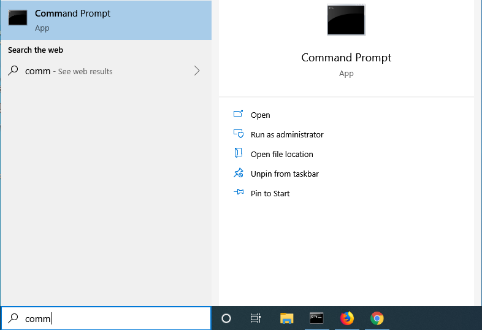
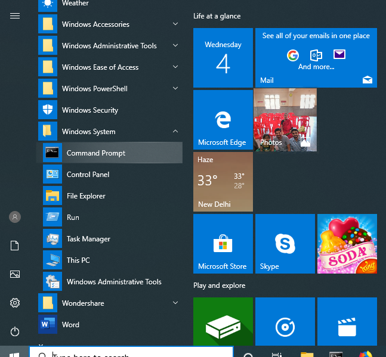
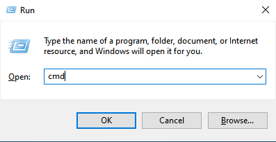
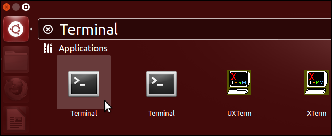
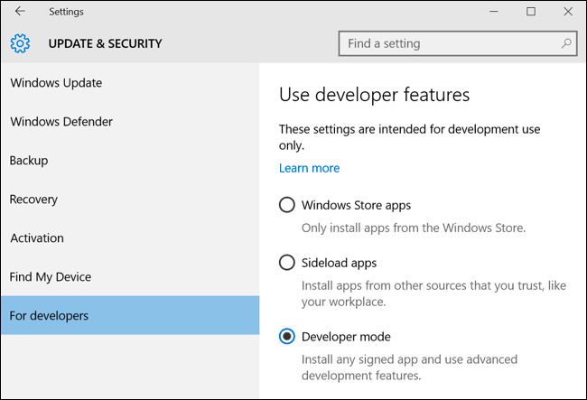
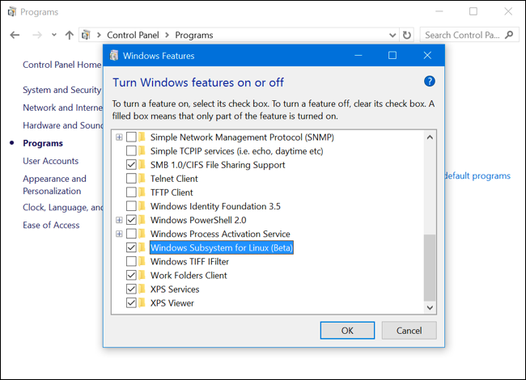
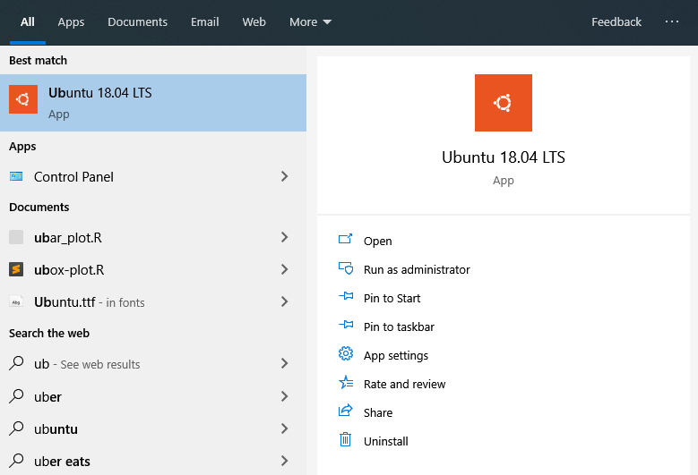
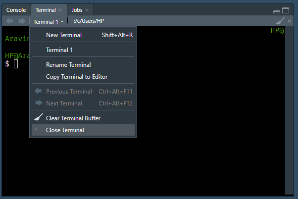
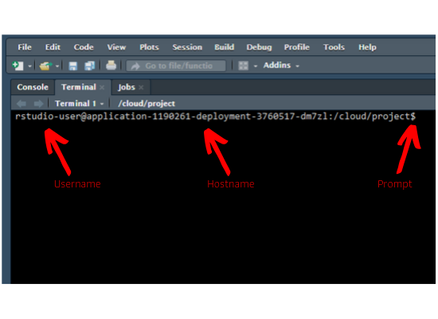

# Introduction {#introduction-to-command-line}

```{r pkg_load, echo=FALSE}
library(knitr)
library(kableExtra)
library(magrittr)
```

## What is Shell/Terminal?

Shell is a text based application for viewing, handling & manipulating files. It
takes in commands and passes them on to the operating system. It is also known
as 

- CLI (Command Line Interface)
- Bash (Bourne Again Shell)
- Terminal

It is sufficient to know a handful of commands to get started with the shell.

## Launch Terminal

Although we will use the terminal in RStudio on [RStudio Cloud](https://rstudio.cloud/), we should still know how to launch the terminal in different operating systems.

### mac

Applications -> Utility -> Terminal

```{r launch_mac, echo=FALSE, fig.align="center", out.width="70%"}
knitr::include_graphics("img/cline_mac-terminal.png")
```

### Windows

#### Option 1

Go to the Start Menu or screen and enter `Command Prompt` in the search field.

```{r launch_windows_1, echo=FALSE, fig.align="center", out.width="70%"}

```

#### Option 2

Start Menu -> Windows System -> Command Prompt

```{r launch_windows_2, echo=FALSE, fig.align="center", out.width="70%"}

```

#### Option 3

Hold the Windows key and press the `R` key to get a `Run` window. Type `cmd` in the box and click on the `OK` button.

```{r launch_windows_3, echo=FALSE, fig.align="center", out.width="70%"}

```

### Linux

- Applications -> Accessories -> Terminal
- Applications -> System      -> Terminal

```{r launch_liux, echo=FALSE, fig.align="center", out.width="70%"}

```

### Windows Subsystem for Linux

If you want to use bash on Windows, try the Windows subsystem for Linux. It only works on 64 bit Windows 10. Below are the steps to enable Windows subsystem fro Linux:

#### Step 1 - Enable Developer Mode

To enable Developer Mode open the Settings app and head to **Update & Security > For Developers**. Press the **Developer Mode** switch.

```{r launch_wsl_1, echo=FALSE, fig.align="center", out.width="70%"}

```

#### Step 2 - Enable Windows Subsystem for Linux

To enable the Windows Subsystem for Linux (Beta), open the **Control Panel**, click **Programs and Features**, and click **Turn Windows Features On or Off** in left side bar under Programs and Features. Enable the **Windows Subsystem for Linux (Beta)** option in the list here and click OK. After you do, you'll be prompted to reboot your computer. Click **Restart Now** to reboot your computer and Windows 10 will install the new feature.

```{r launch_wsl_2, echo=FALSE, fig.align="center", out.width="70%"}

```

#### Step 3 - Install your Linux Distribution of Choice

Open the Microsoft store and choose your favorite Linux distribution.

```{r launch_wsl_3, echo=FALSE, fig.align="center", out.width="70%"}
knitr::include_graphics("img/cline_wsl-3.png")
```

In the distro's page, click on "Get".

```{r launch_wsl_4, echo=FALSE, fig.align="center", out.width="70%"}
knitr::include_graphics("img/cline_wsl-4.png")
```

Launch the distro from the **Start Menu**.

```{r launch_wsl_5, echo=FALSE, fig.align="center", out.width="70%"}

```

You can learn more about the Windows Subsystem for Linux [here](https://docs.microsoft.com/en-us/windows/wsl/about).

### RStudio Terminal

RStudio introduced the terminal with version 1.1.383. The terminal tab is next to the console tab. If it is not visible, use any of the below methods to launch it

- Shift + Alt + T 
- Tools -> Terminal -> New Terminal

Note, the terminal depends on the underlying operating system. To learn more about the RStudio terminal, read this [article](https://support.rstudio.com/hc/en-us/articles/115010737148-Using-the-RStudio-Terminal) or watch this [webinar](https://resources.rstudio.com/webinars/terminal-updates). In this book, we will use the RStudio terminal on [RStudio Cloud](https://rstudio.cloud/) to ensure that all users have access to Linux bash. You can try all the commands used in this book on your local system as well except in case of Windows users.

```{r rstudio_terminal, echo=FALSE, fig.align="center", out.width="70%"}

```

## Prompt

As soon as you launch the terminal, you will see the hostname, machine name and
the prompt. In case of mac & Linux users, the prompt is `$`. For Windows users, it is `>`.

```{r table_prompt, echo=FALSE}
cname   <- c("macOS", "Linux", "Windows")
descrip <- c("$",
             "$",
             ">")
data.frame(OS = cname, Prompt = descrip) %>% 
  kable() %>% 
  kable_styling(
    bootstrap_options = c("striped", "hover", "condensed", "responsive")
  )
```

```{r rstudio_terminal_prompt, echo=FALSE, fig.align="center", out.width="70%"}

```

## Get Started

To begin with, let us learn to display

- basic information about the user
- the current date & time 
- the calendar 
- and clear the screen.

```{r table_get_started, echo=FALSE}
cname   <- c("`whoami`", "`date`", "`cal`", "`clear`")
descrip <- c("Who is the user?",
             "Get date, time and timezone",
             "Display calendar", 
             "Clear the screen")
data.frame(Command = cname, Description = descrip) %>% 
  kable() %>% 
  kable_styling(
    bootstrap_options = c("striped", "hover", "condensed", "responsive")
  )
```

`whoami` prints the effective user id i.e. the name of the user who runs the command. Use it to verify the user as which you are logged into the system.

```{bash whoami}
whoami
```

`date` will display or change the value of the system's time and date information.

```{bash c2}
date
```

`cal` will display a formatted calendar and `clear` will clear all text on the screen and display a new prompt. You can clear the screen by pressing `Ctrl + L` as well.

```{bash cal}
cal
```

In R, we can get the user information from `Sys.info()` or `whoami()` from the [whoami](https://cran.r-project.org/package=whoami) package. The current date & time are returned by `Sys.date()` & `Sys.time()`. To clear the R console, we use Ctrl + L.

```{r r_get_started, echo=FALSE}
cname   <- c("`whoami`", "`date`", "`cal`", "`clear`")
descrip <- c("`Sys.info()` / `whoami::whoami()`",
             "`Sys.date()` / `Sys.time()`",
             "", 
             "`Ctrl + L`")
data.frame(Command = cname, R = descrip) %>% 
  kable() %>% 
  kable_styling(
    bootstrap_options = c("striped", "hover", "condensed", "responsive")
  )
```

## Help/Documentation

Before we proceed further, let us learn to view the documentation/manual pages of the commands. 

```{r table_help, echo=FALSE}
cname   <- c("`man`", "`whatis`")
descrip <- c("Display manual pages for a command",
             "Single line description of a command")
data.frame(Command = cname, Description = descrip) %>% 
  kable() %>% 
  kable_styling(
    bootstrap_options = c("striped", "hover", "condensed", "responsive")
  )
```

`man` is used to view the system's reference manual. Let us use it to view the documentation of the `whatis` command which we will use next. 

```{bash man}
man whatis
```

`whatis` displays short manual page descriptions (each manual page has a short description available within it). 

```{bash whatis}
whatis ls
```

You will find [tldr.sh](https://tldr.sh/) very useful while exploring new commands and there is a related R package, [tldrrr](https://github.com/kirillseva/tldrrr) as well.

```{r tldrrr}
# devtools::install_github("kirillseva/tldrrr")
tldrrr::tldr("pwd")
```