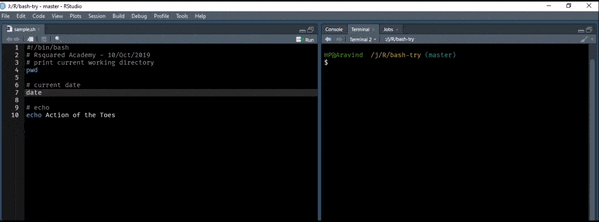
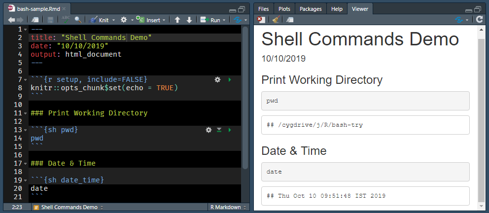

# R & the Shell {#others2}

In this chapter, we will learn to 

- execute shell commands from R
- execute shell script in RStudio
- execute shell commands in RMarkdown
- execute R commands & script in the shell

## R 

Now, let us turn our attention to executing commands from R using `system2()`. 
Here we will focus on the following

- execute a command without arguments
- execute commands with arguments
- redirect output

Let us try to execute a command without any additional arguments. We will execute the `ls` command to list all files and directories. Use `system2()` and specify the command using the `command` argument. Whenever you are trying to execute a command from R, the first argument or input should be the command and it must be enclosed in quotes.

```{r system2_1a, eval=FALSE}
system2(command = "ls")
```

```{r system2_1b, echo=FALSE, eval=FALSE}
system2(command = "ls", stdout = TRUE)
```

Great! Now, how do we specify the options? The additional options of a 
command must be stored as a character vector and specified using the `args`
argument. In the below example, we delete the `examples` folder we created earlier while decompressing the `zip_example.zip` file.

```{r system2_2a, eval=FALSE}
system2(command = "rm",
        args    = c("-r", "examples"))
```

```{r system2_2b, echo=FALSE, eval=FALSE}
system2(command = "rm",
        args    = c("-r", "examples"),
        stdout  = TRUE)
```

In some cases, we might want to redirect the output. Let us say we are writing 
message to a file using the `echo` command. In this cases, we want the output 
to be redirected to the `release.txt` file. The `stdout` argument can be used to redirect output to a file or the R console. In the below example, we redirect the output to a file.

```{r system2_3a, eval=FALSE}
system2(command = "echo", 
        args    = c("Great Truth"), 
        stdout  = "release.txt")
```

In the next example, we redirect the output to the R console by setting the value of the `stdout` argument to `TRUE`. If you are curious, set the value to `FALSE` and see what happens.

```{r system2_4a, eval=FALSE}
system2(command = "diff", 
        args    = c("imports_olsrr.txt", "imports_blorr.txt"),  
        stdout  = TRUE)
```

The `run()` command from the [processx](https://processx.r-lib.org/) package can be used to execute shell commands as well.

## RStudio 

In RStudio, commands can be executed from shell scripts by pressing `Ctrl + Enter`. Instead of sending the command to the R console, it is redirected to 
the terminal where it is executed as shown below.

```{r rstudio_shell, echo=FALSE, fig.align="center", out.width="90%"}

```

## RMarkdown 

RMarkdown supports `bash`, `sh` and `awk`. This post was initially  created using `sh` as the underlying operating system is Windows. Later, we used `bash` after installing the Windows subsystem for Linux. Click [here](https://bookdown.org/yihui/rmarkdown/language-engines.html#shell-scripts) to learn more.

```{r shell_rmarkdown, echo=FALSE, fig.align="center", out.width="90%"}

```

## Rscript

In this section, we will learn to execute R commands and scripts in the command line using:

- `R -e`
- `Rscript -e`
- `R CMD BATCH`

The `-e` option allows us to specify R expression(s). `R -e` will launch R and then execute the code specified within quotes. Use semi-colon to execute multiple expressions as shown below. You will be able to run the below commands only if you are able to launch R from the command line. Windows users need to ensure that R is added to the path environment.

```{sh c118a, eval=FALSE}
R -e "head(mtcars); tail(mtcars)"
```

`Rscript -e` will run code without launching R.

```{sh c119a, eval=FALSE}
Rscript -e "head(mtcars)"
```

We can use `Rscript` to execute a R script as well. In the below example, we execute the code in `analysis.R` file. 

```{sh c120a, eval=FALSE}
Rscript analysis.R
```

If you are more interested, try the [littler](https://cran.r-project.org/package=littler) package as well.