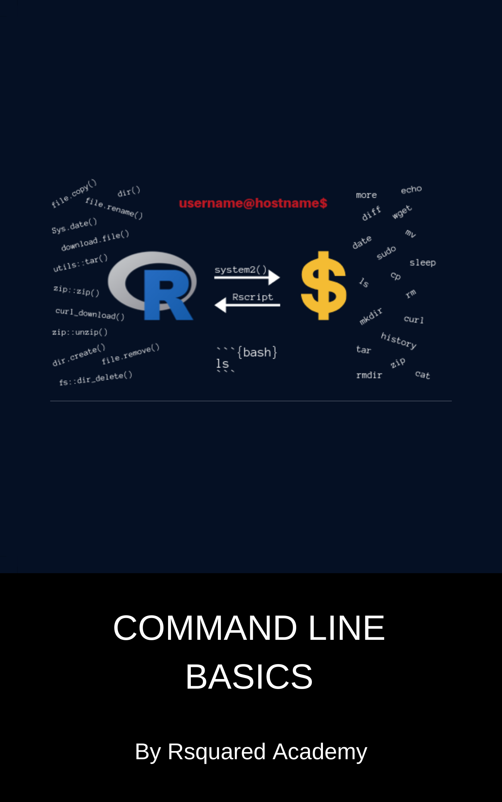

--- 
title: "Command Line Basics for R Users"
author: "Aravind Hebbali"
date: "`r Sys.Date()`"
site: bookdown::bookdown_site
documentclass: book
link-citations: yes
description: "A gentle introduction to the command line."
---

# Welcome {-}

```{r fig.align='center', echo=FALSE, out.width="60%"}

```

This is the website for Command Line Basics for R Users. Visit the [GitHub repository for this site](https://github.com/rsquaredacademy-education/bash-intro).	

<a rel="license" href="http://creativecommons.org/licenses/by-nc-sa/4.0/"></a><br />This work by [Aravind Hebbali](https://www.aravindhebbali.com/) is licensed under a <a rel="license" href="http://creativecommons.org/licenses/by-nc-sa/4.0/">Creative Commons Attribution-NonCommercial-ShareAlike 4.0 International License</a>.

# Preface {-}

In this book, you will be introduced to shell commands. We have selected a set of commands we think will be useful in general to a wide range of audience. We have created a [RStudio Cloud Project](https://rstudio.cloud/project/518720) to ensure that all readers are using the same environment while using code examples. Our goal is to ensure that after reading this book, you should be able to use the shell for version control, managing cloud services (like deploying your own shiny server etc.), execute commands in R & RMarkdown and execute R scripts in the shell. Apart from learning shell commands, the book will also focus on

- exploring R release names
- mapping shell commands to R functions
- RStudio Terminal
- executing shell commands from R using `system2()` or `processx::run()`
- execute shell commands in RMarkdown
- execute R scripts in the shell 

If you want a deeper understanding of using command line for data science, we suggest you read [Data Science at the Command Line](https://www.datascienceatthecommandline.com/). [Software Carpentry](https://software-carpentry.org/) too has a lesson on [shell](https://swcarpentry.github.io/shell-novice/). We have listed more references at the end of the book for the benefit of the readers.

## Outline {-}

We start by introducing what the shell is, how to launch it in different operating system and explore
commands for navigating file system and file management.

* **Chapter \@ref(intro)** introduces the shell. It shows how to launch it in different operating
systems. Apart from introducing the RStudio terminal, it will explore basic commands and different
ways to view the documentation.

* **Chapter \@ref(navigate)** explores how to navigate between different directories, list contents of a directory and 
create & delete files & directories.

* **Chapter \@ref(filemanagement)** describes how to create, copy, move, delete and compare files and directories.

* **Chapter \@ref(io)** demonstrates how to print text on the terminal and read content from files. It will
cover sorting/viewing/searching file contents.

* **Chapter \@ref(regex)** shows how to search text in file(s) using pattern matching and 
find files and folders using names and extensions.

* **Chapter \@ref(sudo)** describes how to install, update and remove packages using `sudo`.

* **Chapter \@ref(datatransfer)** explores how to download files from the internet using `wget` and `curl`.

* **Chapter \@ref(compress)** demonstrates how to list, extract, create and add files to archives using `tar`, `zip` 
and `unzip`.

* **Chapter \@ref(sysinfo)** explains how to view system information using `uname`, `free`, `df` etc.

* **Chapter \@ref(others)** demonstrates how to execute shell commands in R using `system2()`. It will also look
at using shell commands in RMarkdown documents and how to execute R commands and scripts from the command line. 

## Topics this book does not cover {-} 

While the book explores several shell commands and demonstrates how to execute them in R, it does not cover the following topics:

- shell scripting
- editing files
- file permissions
- user information
- pipes
- awk
- sed

## About this book {-}

This book is focused on practical exploration of shell commands. We focus on a select set of commands we hope 
will be useful to beginners and motivate them to explore the command line further. 

We do not assume any previous knowledge of command line. We have used the RStudio terminal and RStudio Cloud to
remove any hurdles for beginners and to ensure all learners have access to the same environment to explore the 
commands. 

We do assume the reader is familiar with R and RStudio. 

## Using code examples {-}

All the codes used in this book are available in our [GitHub repository](https://github.com/rsquaredacademy-education/).
We encourage you to use [RStudio Cloud](https://rstudio.cloud/project/518720) (it is free), especially Windows users as 
you will get access to Linux Bash and all the code and files/directories used in the examples.

## Software information {-}

The R session information when compiling this book is shown below:

```{r session}
sessionInfo()
```
