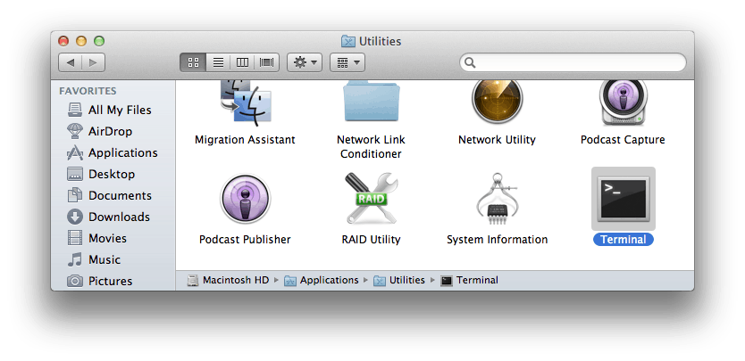
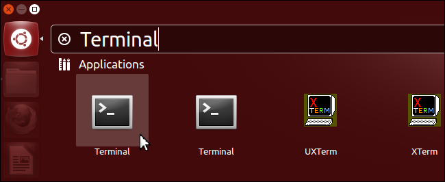
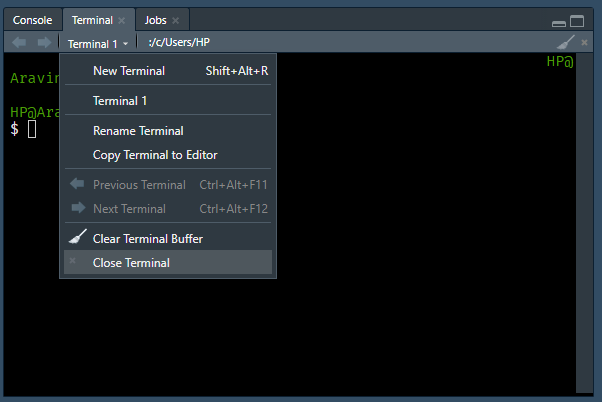
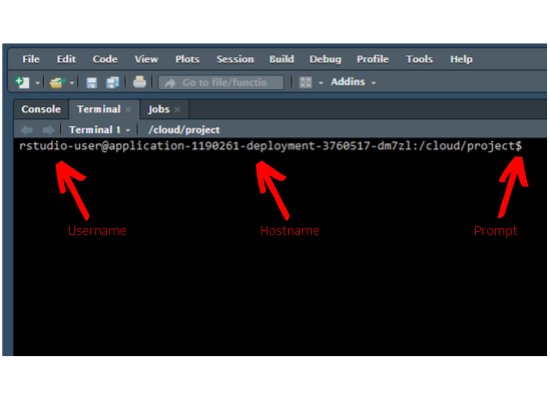

# Introduction {#sec-introduction-to-command-line}

## What is Shell/Terminal?

Shell is a text based application for viewing, handling & manipulating files. It
takes in commands and passes them on to the operating system. It is also known
as 

- CLI (Command Line Interface)
- Bash (Bourne Again Shell)
- Terminal

It is sufficient to know a handful of commands to get started with the shell.

## Choose your setup

Pick the first tier that fits you. All tiers run every command in this book,
except where noted.

- **Tier 0 (recommended, zero setup): [Posit Cloud project](https://posit.cloud/content/13023750)** — one-click RStudio in
  your browser with Linux bash and all book files ready. Nothing to install.
- **Tier 1 (Windows without admin rights): Git Bash inside RStudio** — install
  [Git for Windows](https://git-scm.com/download/win), then open Git Bash via
  *Tools -> Terminal -> New Terminal* in RStudio. Runs everything except
  [`sudo` chapter](sudo-command.qmd) (`sudo apt-get` needs Linux) and the `free` command in the [System Info chapter](command-line-sysinfo.qmd). For those two chapters, switch to the Tier 0
  Posit Cloud project.
- **Tier 2 (Windows with admin rights): WSL2 + Windows Terminal** — full Ubuntu
  Linux on your machine (see below). Runs everything, including `sudo` and `free`.
- **macOS:** use the built-in Terminal (Zsh since Catalina). Every command in
  this book works identically in Zsh; see the BSD note below.
- **Linux:** use your native Bash terminal.

> **Do not run book commands in Windows PowerShell.** PowerShell aliases `ls`
> to `Get-ChildItem` and `curl`/`wget` to `Invoke-WebRequest`, which reject
> standard Unix syntax. Always use Git Bash, WSL2, or Posit Cloud on Windows.

> **Note (macOS: Zsh default and BSD differences).** macOS uses Zsh by default
> (since Catalina, 2019) and ships BSD coreutils instead of GNU coreutils.
> Book commands work the same, except: `head -n -5` (negative counts), `sed -i`,
> and the output format of `cal` and `date -d` differ from Linux. When a result
> looks slightly different on your Mac, it is still correct.

## Launch Terminal

Although we recommend the [Posit Cloud project](https://posit.cloud/content/13023750)
so that everyone uses the same environment, you should still know how to launch
a terminal on your own machine.

### mac

Applications -> Utility -> Terminal

{#fig-launch-mac fig-align="center" width="70%"}

### Windows

#### Option 1 — Git Bash (no admin rights needed)

Install [Git for Windows](https://git-scm.com/download/win) and launch **Git Bash**.
Inside RStudio, select *Tools -> Terminal -> New Terminal*; if Git Bash is your
configured terminal you can run every Tier 1 chapter right there.

#### Option 2 — WSL2 with Windows Terminal (full Ubuntu Linux)

1. Open PowerShell **as Administrator** and run `wsl --install -d Ubuntu`.
2. Reboot when prompted, then launch Ubuntu and create your Linux user.
3. Install [Windows Terminal](https://apps.microsoft.com/detail/9n0dx20hk701)
   and open an Ubuntu tab.

You can learn more about the Windows Subsystem for Linux
[here](https://docs.microsoft.com/en-us/windows/wsl/about).

### Linux

- Applications -> Accessories -> Terminal
- Applications -> System      -> Terminal

{#fig-launch-linux fig-align="center" width="70%"}

### RStudio Terminal

RStudio introduced the terminal with version 1.1.383. The terminal tab is next to the console tab. If it is not visible, use any of the below methods to launch it

- Shift + Alt + T 
- Tools -> Terminal -> New Terminal

Note, the terminal depends on the underlying operating system. To learn more about the RStudio terminal, see the terminal pane documentation in RStudio (Tools -> Terminal). In this book, we will use the RStudio terminal on [Posit Cloud](https://posit.cloud/content/13023750) to ensure that all users have access to Linux bash. You can try all the commands used in this book on your local system as well except in case of Windows users.

{#fig-rstudio-terminal fig-align="center" width="70%"}

## Prompt

As soon as you launch the terminal, you will see the hostname, machine name and
the prompt. In case of mac & Linux users, the prompt is `$`. For Windows users, it is `>`.

| OS | Prompt |
|:---|:-------|
| macOS | `$` |
| Linux | `$` |
| Windows | `>` |

{#fig-prompt fig-align="center" width="70%"}

## Get Started

To begin with, let us learn to display

- basic information about the user
- the current date & time 
- the calendar 
- and clear the screen.

| Command | Description |
|:--------|:------------|
| `whoami` | Who is the user? |
| `date` | Get date, time and timezone |
| `cal` | Display calendar |
| `clear` | Clear the screen |

`whoami` prints the effective user id i.e. the name of the user who runs the command. Use it to verify the user as which you are logged into the system.

```{bash}
whoami
```

`date` will display or change the value of the system's time and date information.

```{bash}
date
```

`cal` will display a formatted calendar and `clear` will clear all text on the screen and display a new prompt. You can clear the screen by pressing `Ctrl + L` as well.

```{bash}
cal
```

In R, we can get the user information from `Sys.info()` or `whoami()` from the [whoami](https://cran.r-project.org/package=whoami) package. The current date & time are returned by `Sys.date()` & `Sys.time()`. To clear the R console, we use Ctrl + L.

| Command | R |
|:--------|:--|
| `whoami` | `Sys.info()` / `whoami::whoami()` |
| `date` | `Sys.date()` / `Sys.time()` |
| `cal` |  |
| `clear` | `Ctrl + L` |

## Help/Documentation

Before we proceed further, let us learn to view the documentation/manual pages of the commands. 

| Command | Description |
|:--------|:------------|
| `man` | Display manual pages for a command |
| `whatis` | Single line description of a command |

`man` is used to view the system's reference manual. Git Bash ships **no**
manpages, so if `man` is unavailable in your terminal, append `--help` to any
command instead (works everywhere) and consult [tldr.sh](https://tldr.sh/)
for practical examples.

```{bash}
#| eval: false
man ls
```

```{bash}
ls --help | head -n 12
```

`whatis` displays short manual page descriptions (each manual page has a short description available within it). Like `man`, it needs the system manual database, so it is shown but not executed here.

```{bash}
#| eval: false
whatis ls
```

You will find [tldr.sh](https://tldr.sh/) very useful while exploring new commands and there is a related R package, [tldrrr](https://github.com/kirillseva/tldrrr) as well.

```{r}
#| eval: false
# devtools::install_github("kirillseva/tldrrr")
tldrrr::tldr("pwd")
```

## Exercises

1. Run `whoami`, then `date`, then `cal` one after another in your terminal. For each command, write down in one sentence what was displayed. Then run `clear` (or press `Ctrl + L`) and confirm you get a fresh empty prompt.
2. Run `ls --help | head -n 12`. Identify one option flag mentioned there and write down what the help text says it does. Then try `man ls` — note whether it opens a manual page or reports no manual on your system (Git Bash ships no manpages; `--help` is the fallback).
3. Visit [tldr.sh](https://tldr.sh/) in a browser (or run `tldr ls` if installed) and find one practical example for `ls` you had not seen in this chapter.
